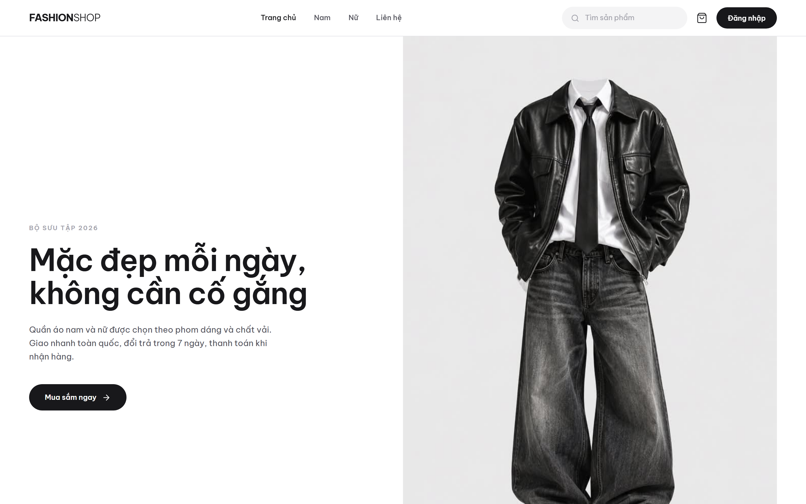
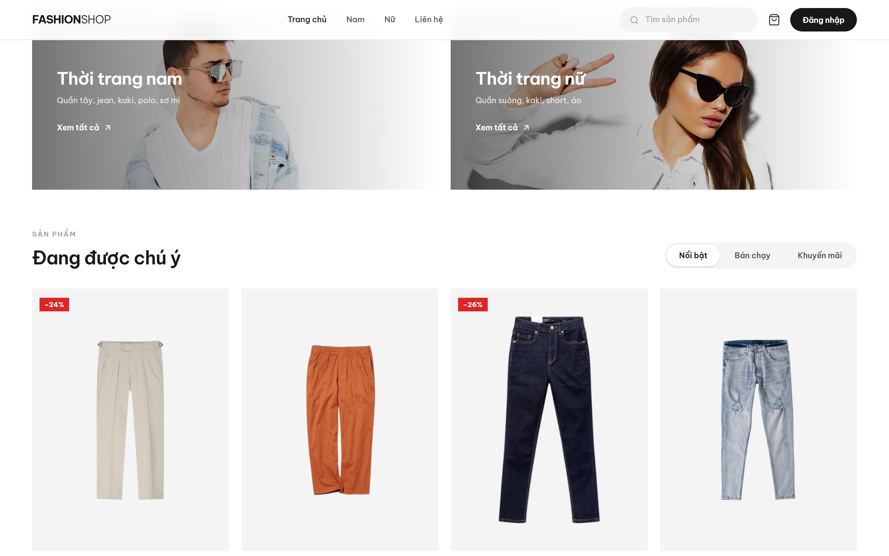
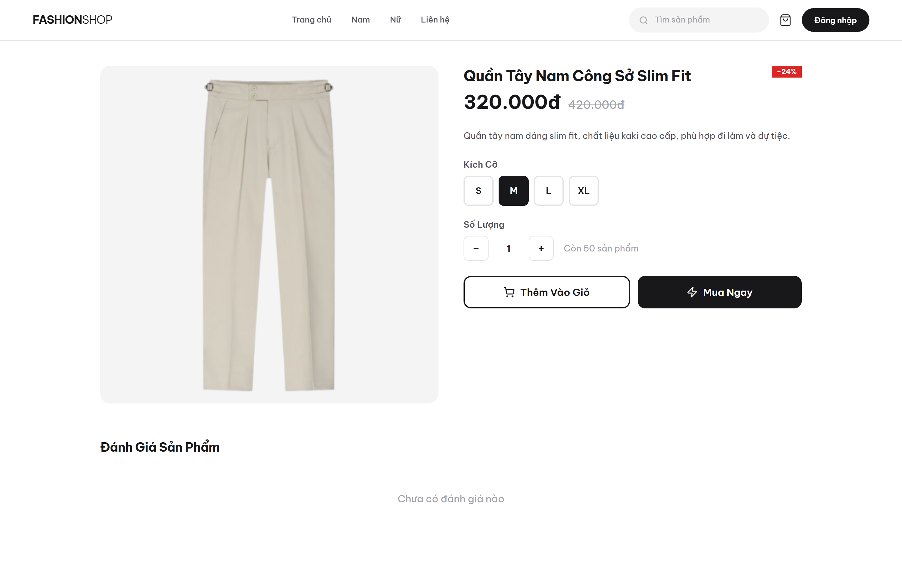
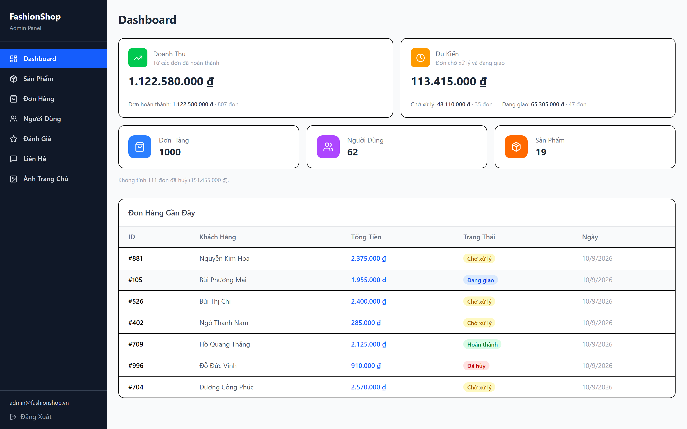
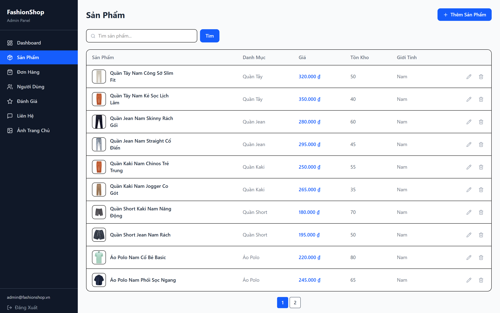
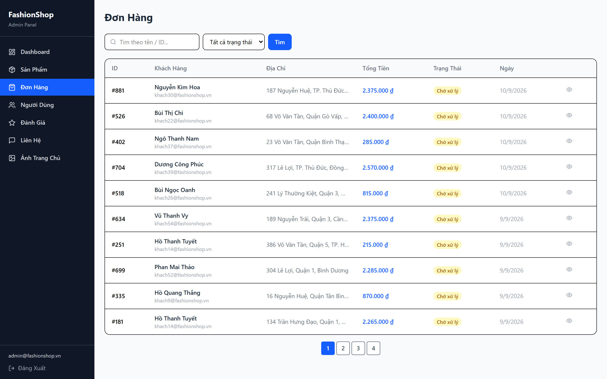
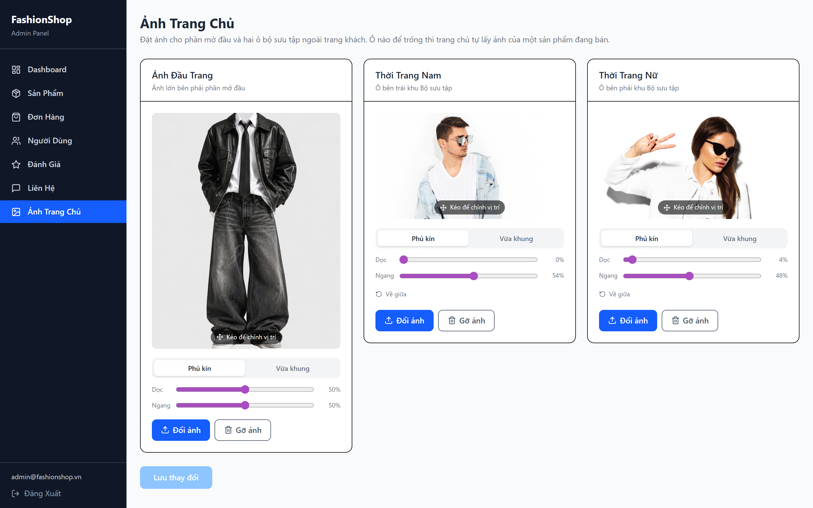

# FashionShop


Hệ thống thương mại điện tử bán quần áo thời trang nam/nữ, xây dựng theo kiến trúc **API-first** với backend Laravel và hai frontend React riêng biệt.

## 🔗 Live Demo

- 🛍️ **Website (khách):** https://fashionshop-web-s4av.onrender.com
- 🔐 **Trang quản trị:** https://fashionshop-admin.onrender.com — đăng nhập demo: `admin@fashionshop.vn` / `Admin123456`
- 🔌 **API:** https://fashion-shop-4wds.onrender.com/api/v1/products

> ⚠️ API chạy trên gói free của Render nên "ngủ" sau ~15 phút không truy cập — lần tải đầu có thể mất ~30–50 giây để đánh thức, sau đó sẽ nhanh bình thường.

---

## 📸 Giao Diện

### Website khách hàng

<p align="center">
  <br>
  <em>Trang chủ — ảnh đầu trang đặt trên nền vải dệt bằng WebGL</em>
</p>

| Danh sách sản phẩm | Chi tiết sản phẩm |
|:---:|:---:|
|  |  |
| Lọc theo tab, nhãn giảm giá, thêm nhanh vào giỏ | Chọn size, số lượng, đánh giá của khách |

### Trang quản trị

<p align="center">
  <br>
  <em>Dashboard — doanh thu tách theo trạng thái đơn, đơn đã huỷ không tính vào doanh thu</em>
</p>

| Quản lý sản phẩm | Quản lý đơn hàng |
|:---:|:---:|
|  |  |
| Thêm, sửa, xoá sản phẩm kèm ảnh | Xem chi tiết và cập nhật trạng thái đơn |

<p align="center">
  <br>
  <em>Ảnh trang chủ — tải ảnh rồi kéo để chọn phần hiển thị, hoặc chỉnh bằng thanh trượt</em>
</p>

---

## Mục lục

1. [Tổng quan](#1-tổng-quan)
2. [Tech Stack](#2-tech-stack)
3. [Tính năng](#3-tính-năng)
4. [Kiến trúc hệ thống](#4-kiến-trúc-hệ-thống)
5. [Cấu trúc thư mục](#5-cấu-trúc-thư-mục)
6. [Yêu cầu môi trường](#6-yêu-cầu-môi-trường)
7. [Cài đặt](#7-cài-đặt)
8. [Biến môi trường](#8-biến-môi-trường)
9. [Chạy Tests](#9-chạy-tests)
10. [API Reference](#10-api-reference)
11. [CI/CD & SonarCloud](#11-cicd--sonarcloud)
12. [Postman Collection](#12-postman-collection)
13. [Database Schema](#13-database-schema)
14. [Deployment (Production)](#14-deployment-production)

---

## 1. Tổng quan

FashionShop gồm 3 ứng dụng độc lập giao tiếp qua REST API:

| Ứng dụng | Mô tả | Port mặc định |
|---|---|---|
| `fashionshop-api` | Laravel 11 REST API | `8000` |
| `fashionshop-web` | React — Storefront cho khách hàng | `5173` |
| `fashionshop-admin` | React — Dashboard quản trị viên | `5174` |

---

## 2. Tech Stack

### Backend — `fashionshop-api`

| Thành phần | Công nghệ |
|---|---|
| Framework | Laravel 11 |
| Ngôn ngữ | PHP 8.3 |
| Auth | Laravel Sanctum (Bearer Token) |
| ORM | Eloquent |
| Database | MySQL 8 |
| File Storage | Laravel Storage (`storage/app/public`) |
| Unit Testing | PHPUnit (SQLite in-memory) |
| Code Style | Laravel Pint |

### Frontend — `fashionshop-web` & `fashionshop-admin`

| Thành phần | Công nghệ |
|---|---|
| Framework | React 19 + Vite |
| Routing | React Router v7 |
| Server State | TanStack Query v5 |
| Client State | Zustand v5 |
| Form | React Hook Form + Zod |
| Styling | Tailwind CSS v4 |
| HTTP Client | Axios |
| Icons | Lucide React |
| Notifications | React Hot Toast |

### Testing

| Thành phần | Công nghệ |
|---|---|
| API Testing | CodeceptJS + REST Helper |
| E2E Testing | CodeceptJS + Playwright |
| Assertion | Chai |

### DevOps

| Thành phần | Công nghệ |
|---|---|
| CI | GitHub Actions |
| Code Quality | SonarCloud |
| Containerization | Docker + Nginx Unprivileged Alpine |

---

## 3. Tính năng

### Khách chưa đăng nhập (Guest)

- Xem trang chủ với các tab: Nổi Bật, Bán Chạy, Khuyến Mãi
- Duyệt sản phẩm theo danh mục và giới tính (Nam/Nữ)
- Tìm kiếm sản phẩm theo tên
- Xem chi tiết sản phẩm và đánh giá
- Đăng ký tài khoản, đăng nhập
- Gửi form liên hệ

### Khách hàng đã đăng nhập (User)

- Thêm sản phẩm vào giỏ (chọn size S/M/L/XL, số lượng)
- Quản lý giỏ hàng (cập nhật số lượng, xóa)
- Đặt hàng với phương thức COD (phí ship 30.000đ)
- Xem lịch sử và chi tiết đơn hàng
- Hủy đơn hàng khi còn trạng thái "Chờ xử lý"
- Viết đánh giá sản phẩm (1–5 sao + bình luận)
- Quản lý địa chỉ giao hàng (thêm, xóa, đặt mặc định)
- Xem và cập nhật hồ sơ cá nhân, đổi mật khẩu

### Quản trị viên (Admin)

- Dashboard thống kê: doanh thu từ đơn đã hoàn thành, doanh thu dự kiến từ đơn
  chờ xử lý và đang giao, tổng đơn, tổng khách hàng. Đơn đã huỷ không tính vào
  doanh thu, chỉ hiển thị dưới dạng ghi chú
- Quản lý sản phẩm: CRUD đầy đủ + upload ảnh (jpg / png / webp)
- Quản lý ảnh trang chủ: đặt ảnh cho phần mở đầu và hai ô bộ sưu tập, kéo trực
  tiếp trên ảnh để chọn phần hiển thị hoặc chỉnh bằng thanh trượt
- Quản lý đơn hàng: xem danh sách, chi tiết, cập nhật trạng thái
- Quản lý người dùng: xem danh sách và chi tiết
- Quản lý đánh giá: phản hồi hoặc xóa
- Quản lý liên hệ: xem và cập nhật trạng thái (new / read / resolved)

---

## 4. Kiến trúc hệ thống

```
┌──────────────────────────┐     ┌──────────────────────────┐
│   fashionshop-web        │     │   fashionshop-admin       │
│   React (Storefront)     │     │   React (Dashboard)       │
│   :5173                  │     │   :5174                   │
└─────────────┬────────────┘     └────────────┬─────────────┘
              │  HTTP + Bearer Token           │
              └──────────────┬─────────────────┘
                             │
              ┌──────────────▼─────────────────┐
              │        fashionshop-api          │
              │   Laravel 11 REST API :8000     │
              │   /api/v1/...                   │
              └──────────────┬─────────────────┘
                             │
              ┌──────────────▼─────────────────┐
              │            MySQL 8              │
              └─────────────────────────────────┘
```

**Luồng xác thực:**
1. Client gửi `POST /api/v1/login` với email + password
2. API trả về Bearer token
3. Client lưu token vào `localStorage` và gửi kèm mọi request: `Authorization: Bearer {token}`
4. API verify token qua Laravel Sanctum
5. Middleware `IsAdmin` kiểm tra thêm role cho các route admin

---

## 5. Cấu trúc thư mục

```
Fashion-Shop/
├── .github/
│   └── workflows/
│       └── ci.yml                  # GitHub Actions CI + SonarCloud
├── fashionshop-api/                # Laravel 11 Backend
│   ├── app/
│   │   ├── Http/
│   │   │   ├── Controllers/Api/
│   │   │   │   ├── Admin/
│   │   │   │   │   ├── ContactController.php
│   │   │   │   │   ├── DashboardController.php
│   │   │   │   │   ├── OrderController.php
│   │   │   │   │   ├── ProductController.php
│   │   │   │   │   ├── ReviewController.php
│   │   │   │   │   └── UserController.php
│   │   │   │   ├── AdminAuthController.php
│   │   │   │   ├── AuthController.php
│   │   │   │   ├── CartController.php
│   │   │   │   ├── CategoryController.php
│   │   │   │   ├── ContactController.php
│   │   │   │   ├── OrderController.php
│   │   │   │   ├── ProductController.php
│   │   │   │   ├── ProfileController.php
│   │   │   │   ├── ReviewController.php
│   │   │   │   └── UserAddressController.php
│   │   │   └── Middleware/
│   │   │       └── IsAdmin.php
│   │   └── Models/
│   │       ├── Admin.php
│   │       ├── Cart.php
│   │       ├── Category.php
│   │       ├── Contact.php
│   │       ├── Order.php
│   │       ├── OrderDetail.php
│   │       ├── Product.php
│   │       ├── Review.php
│   │       ├── User.php
│   │       └── UserAddress.php
│   ├── database/
│   │   ├── migrations/
│   │   └── seeders/
│   ├── routes/
│   │   └── api.php
│   ├── storage/app/public/products/ # Ảnh sản phẩm upload
│   ├── .env
│   ├── .env.example
│   ├── Dockerfile
│   └── docker-entrypoint.sh
│
├── fashionshop-web/                # React Storefront
│   ├── src/
│   │   ├── api/                    # Axios instances + API calls
│   │   ├── components/             # Header, Footer, UI components
│   │   ├── pages/                  # Home, ProductDetail, Cart, Checkout, Orders, ...
│   │   ├── stores/                 # Zustand: authStore, cartStore
│   │   └── utils/                  # constants.js, formatCurrency.js
│   ├── Dockerfile
│   └── nginx.conf
│
├── fashionshop-admin/              # React Admin Dashboard
│   ├── src/
│   │   ├── api/                    # Axios instances + API calls (admin)
│   │   ├── components/             # AdminLayout, Sidebar, UI components
│   │   ├── pages/                  # Dashboard, Products, Orders, Users, Reviews, Contacts
│   │   └── stores/                 # Zustand: authStore
│   ├── Dockerfile
│   └── nginx.conf
│
├── tests/                          # CodeceptJS — API & E2E Tests
│   ├── api/
│   │   ├── products_test.js        # GET /products, /categories, /products/{id}
│   │   ├── cart_test.js            # GET/POST/PATCH/DELETE /cart
│   │   ├── orders_test.js          # POST/GET/PATCH /orders
│   │   ├── reviews_contacts_test.js# POST/GET /reviews, POST /contacts
│   │   ├── address_test.js         # POST/GET/PATCH/DELETE /addresses
│   │   ├── profile_test.js         # GET/PUT /profile, PUT /profile/password
│   │   └── admin_test.js           # Toàn bộ /admin/* endpoints
│   ├── e2e/
│   │   ├── cart_test.js
│   │   ├── orders_test.js
│   │   ├── contact_test.js
│   │   └── register_test.js
│   ├── steps_file.js               # CodeceptJS helpers (registerApiUser, addToCartViaApi, ...)
│   ├── codecept.api.conf.js        # Config chạy API tests
│   ├── codecept.e2e.conf.js        # Config chạy E2E tests
│   └── package.json
│
├── postman-json/
│   └── FashionShop.postman_collection.json
├── sonar-project.properties        # Cấu hình SonarCloud
└── README.md
```

---

## 6. Yêu cầu môi trường

| Công cụ | Phiên bản tối thiểu |
|---|---|
| PHP | 8.2+ |
| Composer | 2.x |
| Node.js | 18+ |
| npm | 9+ |
| MySQL | 8.0 |

> **Laragon** tích hợp sẵn PHP, MySQL, Apache — khuyến nghị cho dev local. Tải tại [laragon.org](https://laragon.org/download/)

---

## 7. Cài đặt

### Bước 1 — Clone project

```bash
git clone <your-repo-url> Fashion-Shop
cd Fashion-Shop
```

### Bước 2 — Cài đặt API

```bash
cd fashionshop-api

composer install

cp .env.example .env
php artisan key:generate
```

Cập nhật `.env` với thông tin database (xem [Biến môi trường](#8-biến-môi-trường)).

```bash
php artisan storage:link
php artisan migrate

# (Tuỳ chọn) Seed dữ liệu mẫu
php artisan db:seed

# Khởi động API server tại http://127.0.0.1:8000
php artisan serve
```

### Bước 3 — Cài đặt Storefront

Mở terminal mới:

```bash
cd fashionshop-web
npm install
npm run dev
# Truy cập: http://localhost:5173
```

### Bước 4 — Cài đặt Admin Dashboard

Mở terminal mới:

```bash
cd fashionshop-admin
npm install
npm run dev
# Truy cập: http://localhost:5174
```

### Kiểm tra nhanh

| URL | Ứng dụng |
|---|---|
| `http://127.0.0.1:8000/api/v1/products` | API — danh sách sản phẩm |
| `http://localhost:5173` | Storefront |
| `http://localhost:5174` | Admin Dashboard |

---

## 8. Biến môi trường

### `fashionshop-api/.env`

```env
APP_NAME=FashionShop
APP_ENV=local
APP_KEY=                        # Tự tạo: php artisan key:generate
APP_DEBUG=true
APP_URL=http://127.0.0.1:8000   # Quan trọng: ảnh URL dùng APP_URL

DB_CONNECTION=mysql
DB_HOST=127.0.0.1
DB_PORT=3306
DB_DATABASE=fashionshop
DB_USERNAME=root
DB_PASSWORD=

FILESYSTEM_DISK=local
```

> `APP_URL` phải khớp với địa chỉ thực tế của API. Nếu dùng `php artisan serve` → `http://127.0.0.1:8000`.

### Frontend — biến môi trường

Cả hai frontend đọc địa chỉ API qua biến build-time `VITE_API_URL`. Nếu không set, mặc định trỏ về `http://127.0.0.1:8000` (dev local).

```env
# fashionshop-web/.env & fashionshop-admin/.env
VITE_API_URL=http://127.0.0.1:8000
```

Base URL được dựng trong `src/api/axios.js`:
```js
baseURL: `${import.meta.env.VITE_API_URL ?? "http://127.0.0.1:8000"}/api/v1`
```

> Khi deploy, chỉ cần đặt `VITE_API_URL` = URL API thật (vd trên Render) là frontend tự trỏ đúng — không cần sửa code.

---

## 9. Chạy Tests

Cài dependencies (chỉ lần đầu):

```bash
cd tests
npm install
```

### API Tests

> Yêu cầu: `php artisan serve` đang chạy ở terminal khác.

```bash
# Chạy toàn bộ API tests
npm run test:api

# Chỉ chạy admin tests
npm run test:api:admin

# Chạy một file cụ thể
npx codeceptjs run api/cart_test.js -c codecept.api.conf.js --steps
```

**Các file API test:**

| File | Endpoint được test |
|---|---|
| `products_test.js` | `/products`, `/categories`, `/products/{id}/reviews` |
| `cart_test.js` | `/cart` (GET/POST/PATCH/DELETE) |
| `orders_test.js` | `/orders` (POST/GET/PATCH cancel) |
| `reviews_contacts_test.js` | `/products/{id}/reviews`, `/contacts` |
| `address_test.js` | `/addresses` (POST/GET/PATCH default/DELETE) |
| `profile_test.js` | `/profile`, `/profile/password` |
| `admin_test.js` | Toàn bộ `/admin/*` endpoints |

### E2E Tests

> Yêu cầu: API server + `npm run dev` của cả web và admin đang chạy.

```bash
npm run test:e2e
```

---

## 10. API Reference

**Base URL:** `http://127.0.0.1:8000/api/v1`

**Auth header:** `Authorization: Bearer {token}`

**Format:** `Content-Type: application/json`

---

### Auth — User

| Method | Endpoint | Auth | Mô tả |
|---|---|---|---|
| `POST` | `/register` | — | Đăng ký tài khoản |
| `POST` | `/login` | — | Đăng nhập |
| `POST` | `/logout` | ✅ | Đăng xuất |

**POST `/register`**
```json
{
  "fullname": "Nguyễn Văn A",
  "email": "user@gmail.com",
  "phone": "0912345678",
  "gender": "Nam",
  "password": "password123",
  "password_confirmation": "password123"
}
```

**POST `/login`** → Response:
```json
{
  "message": "Đăng nhập thành công",
  "user": { "id": 1, "fullname": "...", "email": "..." },
  "token": "1|abc123..."
}
```

---

### Auth — Admin

| Method | Endpoint | Auth | Mô tả |
|---|---|---|---|
| `POST` | `/admin/login` | — | Đăng nhập admin |
| `POST` | `/admin/logout` | ✅ Admin | Đăng xuất admin |

---

### Products (Public)

| Method | Endpoint | Query Params | Mô tả |
|---|---|---|---|
| `GET` | `/products` | `page`, `keyword`, `category_id`, `gender` | Danh sách sản phẩm (phân trang 10/trang) |
| `GET` | `/products/{id}` | — | Chi tiết sản phẩm (kèm category + reviews) |

---

### Categories (Public)

| Method | Endpoint | Mô tả |
|---|---|---|
| `GET` | `/categories` | Danh sách tất cả danh mục |

---

### Reviews

| Method | Endpoint | Auth | Mô tả |
|---|---|---|---|
| `GET` | `/products/{id}/reviews` | — | Xem đánh giá của sản phẩm |
| `POST` | `/products/{id}/reviews` | ✅ | Viết đánh giá |

**POST `/products/{id}/reviews`**
```json
{
  "rating": 5,
  "comment": "Sản phẩm rất tốt!"
}
```

---

### Contacts (Public)

| Method | Endpoint | Mô tả |
|---|---|---|
| `POST` | `/contacts` | Gửi form liên hệ |

```json
{
  "fullname": "Nguyễn Khách",
  "email": "khach@gmail.com",
  "phone": "0912345678",
  "message": "Tôi muốn hỏi về sản phẩm"
}
```

---

### Profile (Auth — User)

| Method | Endpoint | Mô tả |
|---|---|---|
| `GET` | `/profile` | Xem thông tin cá nhân |
| `PUT` | `/profile` | Cập nhật thông tin |
| `PUT` | `/profile/password` | Đổi mật khẩu |

**PUT `/profile/password`**
```json
{
  "old_password": "matkhaucu",
  "new_password": "matkhaumoi",
  "new_password_confirmation": "matkhaumoi"
}
```

---

### Addresses (Auth — User)

| Method | Endpoint | Mô tả |
|---|---|---|
| `GET` | `/addresses` | Danh sách địa chỉ |
| `POST` | `/addresses` | Thêm địa chỉ mới |
| `PATCH` | `/addresses/{id}/default` | Đặt làm địa chỉ mặc định |
| `DELETE` | `/addresses/{id}` | Xóa địa chỉ |

**POST `/addresses`**
```json
{
  "fullname": "Nguyễn Văn A",
  "phone": "0912345678",
  "address_details": "123 Đường ABC, Quận 1, TP.HCM",
  "is_default": false
}
```

---

### Cart (Auth — User)

| Method | Endpoint | Mô tả |
|---|---|---|
| `GET` | `/cart` | Xem giỏ hàng |
| `POST` | `/cart` | Thêm sản phẩm vào giỏ |
| `PATCH` | `/cart/{id}` | Cập nhật số lượng |
| `DELETE` | `/cart/{id}` | Xóa khỏi giỏ |

**POST `/cart`**
```json
{
  "product_id": 1,
  "quantity": 2,
  "size": "M"
}
```

Size hợp lệ: `S` / `M` / `L` / `XL`

---

### Orders (Auth — User)

| Method | Endpoint | Mô tả |
|---|---|---|
| `GET` | `/orders` | Lịch sử đơn hàng |
| `POST` | `/orders` | Đặt hàng (từ giỏ hàng hiện tại) |
| `GET` | `/orders/{id}` | Chi tiết đơn hàng |
| `PATCH` | `/orders/{id}/cancel` | Hủy đơn (chỉ khi status = pending) |

**POST `/orders`**
```json
{
  "fullname": "Nguyễn Văn A",
  "phone": "0912345678",
  "address": "123 Đường ABC, Quận 1, TP.HCM",
  "payment": "COD"
}
```

> Phí ship cộng tự động: **30.000đ**. Giỏ hàng bị xóa sau khi đặt hàng thành công.

---

### Admin — Dashboard

| Method | Endpoint | Mô tả |
|---|---|---|
| `GET` | `/admin/dashboard` | Thống kê tổng quan (doanh thu, đơn hàng, users, sản phẩm) |

---

### Admin — Products

| Method | Endpoint | Mô tả |
|---|---|---|
| `GET` | `/admin/products` | Danh sách sản phẩm (`?page=`, `?keyword=`) |
| `POST` | `/admin/products` | Thêm sản phẩm (`multipart/form-data`) |
| `POST` | `/admin/products/{id}` | Cập nhật sản phẩm (`multipart/form-data`) |
| `DELETE` | `/admin/products/{id}` | Xóa sản phẩm |

> Cập nhật dùng `POST` thay vì `PUT` vì PHP không hỗ trợ `multipart/form-data` với `PUT`.

**Form-data fields khi thêm/sửa:**

| Field | Type | Bắt buộc | Mô tả |
|---|---|---|---|
| `ten_sp` | string | ✅ | Tên sản phẩm |
| `gia` | integer | ✅ | Giá bán (VNĐ) |
| `gia_cu` | integer | — | Giá cũ (hiển thị giảm giá) |
| `mo_ta` | string | — | Mô tả sản phẩm |
| `so_luong` | integer | ✅ | Số lượng tồn kho |
| `gioi_tinh` | `0` hoặc `1` | ✅ | `1` = Nam, `0` = Nữ |
| `category_id` | integer | — | ID danh mục |
| `hinh_anh` | file | — | Ảnh (jpg/jpeg/png/webp, max 5MB) |

---

### Admin — Orders

| Method | Endpoint | Mô tả |
|---|---|---|
| `GET` | `/admin/orders` | Danh sách đơn hàng (`?status=`, `?keyword=`) |
| `GET` | `/admin/orders/{id}` | Chi tiết đơn hàng |
| `PATCH` | `/admin/orders/{id}/status` | Cập nhật trạng thái |

**PATCH `/admin/orders/{id}/status`**
```json
{ "status": "shipping" }
```

Luồng trạng thái: `pending` → `shipping` → `completed` / `cancelled`

---

### Admin — Users

| Method | Endpoint | Mô tả |
|---|---|---|
| `GET` | `/admin/users` | Danh sách người dùng |
| `GET` | `/admin/users/{id}` | Chi tiết người dùng |

---

### Admin — Reviews

| Method | Endpoint | Mô tả |
|---|---|---|
| `GET` | `/admin/reviews` | Danh sách đánh giá |
| `PATCH` | `/admin/reviews/{id}/reply` | Phản hồi đánh giá |
| `DELETE` | `/admin/reviews/{id}` | Xóa đánh giá |

**PATCH `/admin/reviews/{id}/reply`**
```json
{ "shop_reply": "Cảm ơn bạn đã đánh giá sản phẩm!" }
```

---

### Admin — Contacts

| Method | Endpoint | Mô tả |
|---|---|---|
| `GET` | `/admin/contacts` | Danh sách liên hệ |
| `PATCH` | `/admin/contacts/{id}/status` | Cập nhật trạng thái |

**PATCH `/admin/contacts/{id}/status`**
```json
{ "status": "read" }
```

Giá trị hợp lệ: `new` / `read` / `resolved`

---

### HTTP Status Codes

| Code | Ý nghĩa |
|---|---|
| `200` | Thành công |
| `201` | Tạo mới thành công |
| `400` | Request không hợp lệ (vd: giỏ hàng trống) |
| `401` | Chưa xác thực (thiếu/sai token) |
| `403` | Không có quyền (user vào route admin) |
| `404` | Không tìm thấy resource |
| `422` | Validation thất bại |
| `500` | Lỗi server |

---

## 11. CI/CD & SonarCloud

### CI — GitHub Actions

File: `.github/workflows/ci.yml`

Tự động chạy khi **push lên `main`/`develop`** hoặc **mở Pull Request vào `main`**.

**4 job:**

| Job | Điều kiện | Bước |
|---|---|---|
| `api` (PHP 8.3) | Mọi push/PR | `composer install` → copy `.env.example` → `key:generate` → `php artisan test --coverage` (SQLite) |
| `admin` (Node 20) | Mọi push/PR | `npm ci` → `npm run build` |
| `web` (Node 20) | Mọi push/PR | `npm ci` → `npm run lint` → `npm run build` |
| `sonarcloud` | Sau khi cả 3 job trên pass | Scan code quality, security, duplication |

### SonarCloud

Cấu hình tại `sonar-project.properties`. Scan các thư mục:

- **Sources:** `fashionshop-api/app`, `fashionshop-web/src`, `fashionshop-admin/src`
- **Tests:** `fashionshop-api/tests`, `tests/api`, `tests/e2e`
- **Coverage:** PHP coverage từ PHPUnit (`coverage.xml`)

Kết quả xem tại tab **Actions** trên GitHub hoặc dashboard SonarCloud.

---

## 12. Postman Collection

File: `postman-json/FashionShop.postman_collection.json`

**Import vào Postman:**

1. Mở Postman → **Import**
2. Kéo thả file `FashionShop.postman_collection.json`
3. Tạo Environment với biến `base_url = http://127.0.0.1:8000/api/v1`

**3 nhóm request:**

| Nhóm | Số request | Mô tả |
|---|---|---|
| Public | 7 | Register, Login, Categories, Products, Reviews, Contacts |
| USER | 21 | Cart, Addresses, Orders, Profile, Password, Logout |
| ADMIN | 17 | Login, Dashboard, Products, Orders, Users, Reviews, Contacts, Logout |

**Tính năng tự động:**
- Login/Register → token tự lưu vào `{{token}}`
- Admin Login → token tự lưu vào `{{admin_token}}`
- ID (product, order, cart, address...) tự truyền giữa các request
- Có test script kiểm tra response ở từng request (bao gồm cả test BUG có chủ ý)

---

## 13. Database Schema

10 bảng chính:

```
admin
├── id, fullname, email, phone, password (bcrypt), created_at

users
├── id, fullname, email, phone, gender (Nam/Nữ), password (bcrypt), created_at

user_addresses
├── id, user_id (FK), fullname, phone, address_details, is_default, created_at

categories
├── id, ten_danh_muc

products
├── id, ten_sp, gia, gia_cu, mo_ta, so_luong
├── gioi_tinh (1=Nam, 0=Nữ), category_id (FK)
├── hinh_anh (path: "products/filename.jpg")
├── created_at, updated_at

cart
├── id, user_id (FK), product_id (FK), quantity, size (S/M/L/XL), created_at

orders
├── id, user_id (FK), fullname, phone, address
├── payment (COD), total, shipping_fee
├── status: pending | shipping | completed | cancelled
├── created_at, updated_at

order_details
├── id, order_id (FK), product_id (FK)
├── quantity, price (snapshot giá lúc đặt), size

reviews
├── id, product_id (FK), user_id (FK)
├── rating (1–5), comment, shop_reply (nullable)
├── created_at

contacts
├── id, fullname, email, phone, message
├── status: new | read | resolved
├── created_at
```

**Ảnh sản phẩm:**
- Lưu tại: `fashionshop-api/storage/app/public/products/`
- Truy cập qua URL: `{APP_URL}/storage/products/{filename}`
- Yêu cầu chạy `php artisan storage:link` để tạo symlink

---

## 14. Deployment (Production)

Toàn bộ hệ thống được deploy **miễn phí** và chạy 24/7, độc lập với máy local.

```
   Render Static Site          Render Static Site
   fashionshop-web             fashionshop-admin
   (Vite build → CDN)          (Vite build → CDN)
           │                           │
           └─────────────┬─────────────┘
                         │  HTTPS  (VITE_API_URL)
              ┌──────────▼───────────┐
              │   Render Web Service  │
              │   fashionshop-api     │
              │   Docker (PHP 8.3)    │
              └──────────┬───────────┘
                         │  SSL/TLS
              ┌──────────▼───────────┐
              │   TiDB Serverless     │
              │   (MySQL-compatible)  │
              └──────────────────────┘
```

| Thành phần | Nền tảng | Ghi chú |
|---|---|---|
| API (Laravel) | Render — Web Service (Docker) | Build từ `fashionshop-api/Dockerfile`; entrypoint tự chạy `migrate` + `artisan serve` |
| Storefront | Render — Static Site | Build Vite → phục vụ qua CDN, luôn bật |
| Admin | Render — Static Site | Build Vite → phục vụ qua CDN, luôn bật |
| Database | TiDB Cloud — Serverless (tương thích MySQL) | Kết nối bắt buộc SSL/TLS |

**Điểm cấu hình khi deploy:**

- Frontend đọc URL API qua biến build-time `VITE_API_URL` → không hardcode.
- API kết nối DB qua các biến `DB_*` và `MYSQL_ATTR_SSL_CA` (trỏ tới kho chứng chỉ hệ thống `/etc/ssl/certs/ca-certificates.crt` trong image).
- Entrypoint tự chạy `migrate`, và tự `db:seed` khi bảng `products` còn rỗng — nên trỏ API sang một database mới là nó tự nạp đủ danh mục, sản phẩm và đơn hàng mẫu.
- Đặt `DB_CONNECTION=sqlite` sẽ chạy demo bằng SQLite ngay trong container, không cần database ngoài (dữ liệu sẽ mất khi container khởi động lại).
- `config/cors.php` mở CORS cho request cross-origin từ frontend.
- Static Site cấu hình rewrite `/* → /index.html` để React Router hoạt động khi reload trang con.
- Container bind cổng động qua `${PORT}` do Render cấp.

> Gói free của Render cho Web Service sẽ "ngủ" sau ~15 phút không có truy cập; request đầu tiên sau đó mất ~30–50s để đánh thức, sau đó chạy bình thường.

---

*Được xây dựng với Laravel 11 + React 19 · Deploy trên Render + TiDB Cloud*
